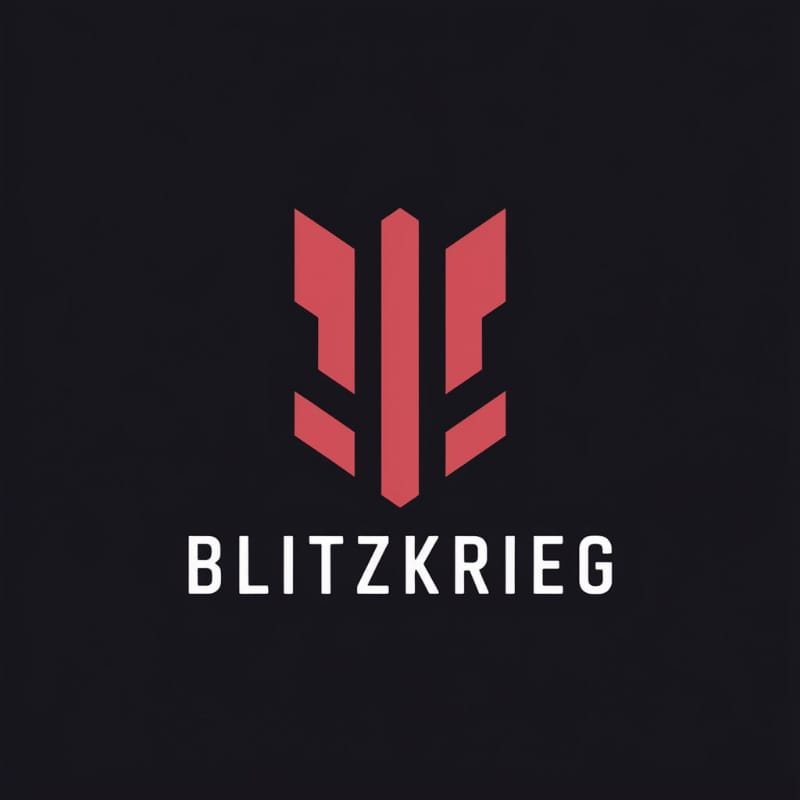

# Arctic Sentinel
CODE@FROST 2025 Hackathon Team

## Team
### Team Name
*BLITZKRIEG*

### Team Members
1. *Jibran Noorshah*: Developing API calls, data pipeline logic, formulating the research.

2. *Uttirn Gyan*: Developing NLP logic, MITRE mapping logic,formulating the idea.

3. *Naren Jindal*: Making the presentation using tools like Canva and making of the video using Microsoft Clipchamp. Providing insights, performing research to innovate.

## Track
Arctic Analytics: Data & Intelligence

## Problem Statement
ProblemStatement #10: Autonomous Security Threat Intelligence Aggregator

## Documentation Reference

1. **NVD API v2.0 Documentation**  
   `https://nvd.nist.gov/developers/vulnerabilities`  
   *CVE data retrieval, CVSS v3/v2 parsing, keyword search parameters*

2. **Sentence Transformers - ATTACK-BERT**  
   `https://huggingface.co/basel/ATTACK-BERT`  
   *Cybersecurity-specific embeddings, cosine similarity implementation*

3. **Streamlit Documentation**  
   `https://docs.streamlit.io/`  
   *Session state, caching (`@st.cache_resource`), multi-page apps, Plotly integration*

4. **Plotly Express Documentation**  
   `https://plotly.com/python/plotly-express/`  
   *Area charts, Gantt timelines, pie charts, heatmaps, color mappings*

5. **ReportLab Documentation**  
   `https://docs.reportlab.com/reportlab/userguide/`  
   *PDF generation, Paragraph/Table styling, Image embedding, page layouts*

**Plus Kaleido docs for `pio.to_image()` chart-to-PNG conversion.**

## Live Deployment Link

Link: https://arcticsentinel.streamlit.app

## Video Demonstration Link
Link: 

## Presentation Link
Link: https://www.canva.com/design/DAG8-Fu_p0k/Ji80loMJRxg5wAcqUVMK7Q/view?utm_content=DAG8-Fu_p0k&utm_campaign=designshare&utm_medium=link2&utm_source=uniquelinks&utlId=hd5383fbc38

## Tech Stack (Inclusive of Justification of Use)
Primary Programming Language: Python

Frontend Framework (or Library): ```streamlit``` (Python)

Backend: ```torch```, ```sklearn``` (scikit-learn), ```pandas```, ```numpy```, ```sentence_transformers```

Tech Stack: ATTACK-BERT embeddings, Plotly interactive, ReportLab PDF generation. Fully functional threat intel platform with ML-powered similarity matching and automated reporting.


## Summary of Idea
Arctic Sentinel is a Streamlit-based CVE threat analysis platform with 5 integrated pages:Core Features:

📊 Overview: Real-time metrics, severity pie charts, vendor histograms, CVE timelines (publication trends + Gantt age visualization), ATTACK-BERT text-to-vulnerability search (20% threshold) with live dataset augmentation

🔐 CVE Intelligence: Vendor risk heatmaps, BERT-powered related CVE discovery with similarity scores, complete CVE catalog

🎯 MITRE ATT&CK: Tactic frequency analysis, semantic tactic relationships, attack vector breakdowns🔍 Advanced Search: Multi-parameter filtering with row-formatted results (vendor/product/CVE/MITRE/description)

📄 PDF Export: One-click professional reports embedding all charts + dynamic remediation strategies

## Working of the project

The project has 1 folder called models which holds the files threat_timeline.py (to process the asset list) and mitre_cross_mapper.py ( to get similar mitre ids and cve ids ) 

another folder called pages which has 2 files upload.py( to upload the asset list ) and dashboard.py ( the main dashboard ) 

this repository also has a requirements.txt file having all the nesscessary python libraries , an app.py file for the main screen of the app as well as mock asset.csv file 
